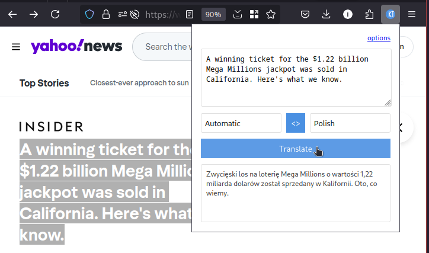
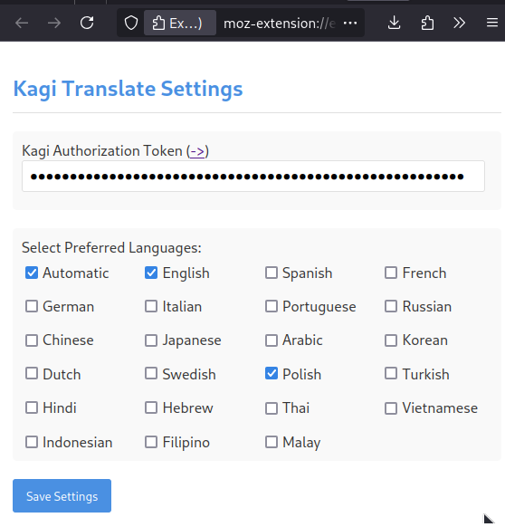

# Kagi Translate Extension (Unofficial)

Extensions for firefox and chrome that translate selected text using kagi.translate.com service.

## Installation

1. There are two extensions in dist folder, currently only available to install in debug mode (about:debugging in firefox and chrome://extensions with developer mode turned on)
2. After installation go to options of the extension and enter your Kagi Authorization Token and select languages you want to use.

## Note
This is an unofficial extension and is not affiliated with Kagi.
As well as it's rather alpha state
