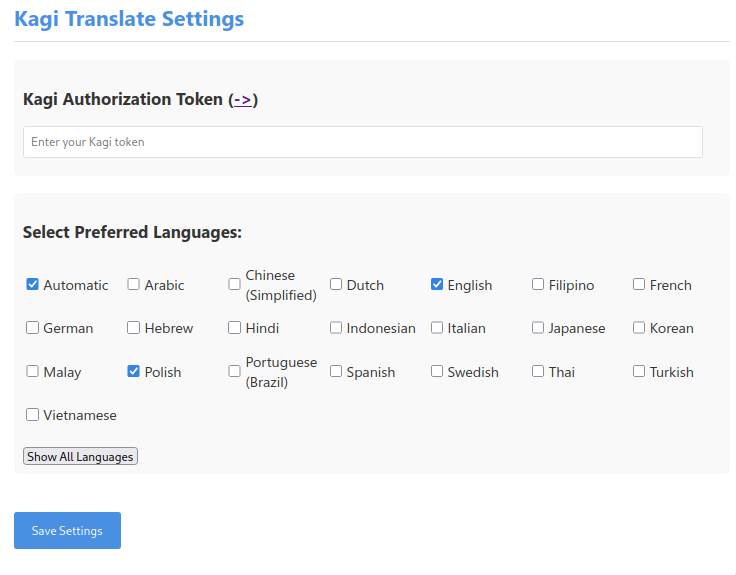

# Kagi Translate Extension (Unofficial)

Extensions for firefox and chrome that translate selected text using translate.kagi.com service.

## Installation

1. There are two extensions in dist folder, currently only available to install in debug mode (about:debugging in firefox and chrome://extensions with developer mode turned on)
2. After installation go to options of the extension and enter your Kagi Authorization Token and select languages you want to use.




## Building

`make` will create extension in `./dist` folder (it's already builded and included in repo tho)

### requires installed npm

```
make firefox
make chrome
```

### with docker

```
make firefox_docker
make chrome_docker
```


## Permissions

This addon uses following permissions:

- `activeTab`, `scripting` - on active tab get selected text and put it in popup's textarea to translate
- `storage` - keep settings
- `cookies` - use to auth with translate.kagi.com


## Note
This is an unofficial extension and is not affiliated with Kagi.
As well as it's rather alpha state
