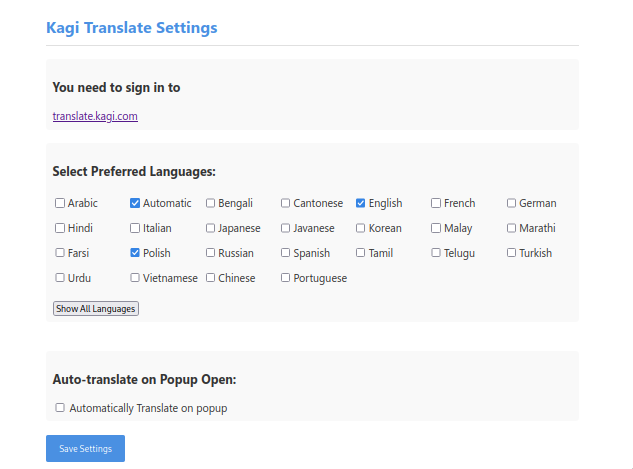

# Kagi Translate Extension (Unofficial)

Extensions for firefox and chrome that translate selected text using translate.kagi.com service.

## Installation

- [addons.mozilla.org](https://addons.mozilla.org/en-US/firefox/addon/kagi-translate-extension/).

1. There are two extensions in dist folder, to install it in debug mode - `about:debugging` in firefox and `chrome://extensions` with developer mode in chrome
2. After installation go to options of the extension and select languages you want to use.
3. Sign in to [translate.kagi.com](https://translate.kagi.com/).




## Building

`make` will create extension in `./dist` folder (it's already builded and included in repo tho)

### requires installed npm

```
make firefox
make chrome
```

### with docker

```
make firefox_docker
make chrome_docker
```


## Permissions

This addon uses following permissions:

- `activeTab`, `scripting` - on active tab get selected text and put it in popup's textarea to translate
- `storage` - keep settings


## TODO

- [ ] Look into streaming the response to reduce display latency and perceived lag.


## Note
This is an unofficial extension and is not affiliated with Kagi.
